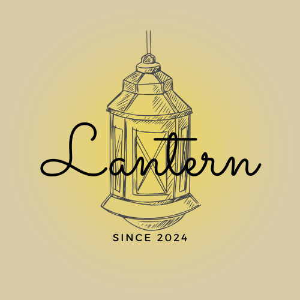

# Lantern Restaurant Website

A responsive restaurant website showcasing Lantern's diverse cuisine offerings including Pakistani, Italian, Asian, and Mexican menus.

## Features

- **Multi-page Website**: Separate pages for each cuisine type
- **Responsive Design**: Works on desktop, tablet, and mobile devices
- **Interactive Elements**: JavaScript functionality for enhanced user experience
- **Bootstrap Integration**: Utilizes Bootstrap framework for styling and components
- **Contact Form**: Allows customers to get in touch

## Pages

- **Homepage** (`index.html`) - Main landing page
- **About Us** (`about-us.html`) - Information about the restaurant
- **Contact** (`contactUs.html`) - Contact form and information
- **Cuisine Pages**:
  - Pakistani (`pakistani.html`)
  - Italian (`italian.html`)
  - Asian (`asian.html`)
  - Mexican (`mexican.html`)
- **Restaurant Cuisine** (`restaurant-cuisine.html`) - Overview of all cuisines

## Technologies Used

- HTML5
- CSS3
- JavaScript
- Bootstrap Framework

## Project Structure
lantern-restaurant-website/
├── index.html # Homepage (main entry point)
├── about-us.html # About page
├── contactUs.html # Contact page
├── pakistani.html # Pakistani cuisine menu
├── italian.html # Italian cuisine menu
├── asian.html # Asian cuisine menu
├── mexican.html # Mexican cuisine menu
├── restaurant-cuisine.html # Cuisine overview
├── Lantern.png # Restaurant logo/image
├── css/ # Stylesheets directory
│ └── styles.css # Main CSS file
├── js/ # JavaScript directory
│ └── script.js # Main JavaScript file
├── bootstrap/ # Bootstrap framework files
└── photos/ # Image assets directory

## Setup and Installation

1. Clone or download this repository
2. Open `index.html` in your web browser to view the website
3. No additional dependencies required as Bootstrap is included locally

## Customization

To customize this website for your own restaurant:

1. Replace placeholder text with your restaurant's information
2. Update images in the `photos` directory with your own restaurant photos
3. Modify menu items and prices in the respective HTML files
4. Adjust color scheme in CSS files to match your branding

## Browser Support

This website supports all modern browsers including:
- Chrome (latest)
- Firefox (latest)
- Safari (latest)
- Edge (latest)

## License

This project is open source and available under the [MIT License](LICENSE).

## Contributing

Contributions, issues, and feature requests are welcome. Feel free to check the issues page.

## Contact
Unzish Maira  [@UnzishMaira](https://github.com/UnzishMaira)
Project Link: [https://github.com/UnzishMaira/lantern-restaurant-website](https://github.com/UnzishMaira/lantern-restaurant-website)
